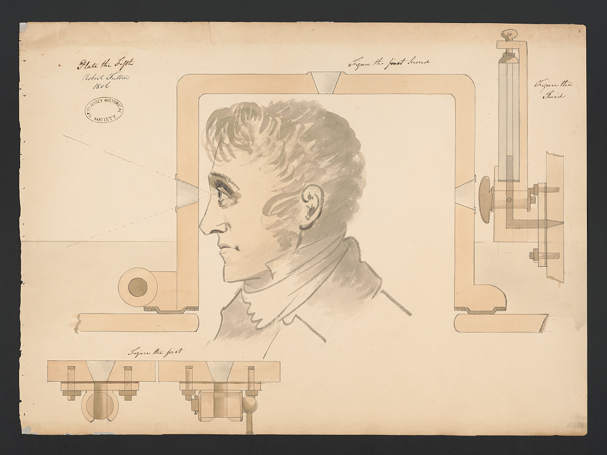

<figure class="wp-block-image">

 

<figcaption>Fulton, R. (1806) Submarine "Submarine Vessel, Submarine Bombs and Mode of Attack" for the United States government. Vessel sighting mechanism details. , 1806. [Photograph] Retrieved from the Library of Congress, https://www.loc.gov/item/96509728/.</figcaption>
</figure>

Welcome to my blog! I post infrequently about things, mostly related to computers and software, I am working on.

The blog is hosted on Github pages and built using [Hugo](https://gohugo.io) using the [smol](https://github.com/colorchestra/smol) theme.